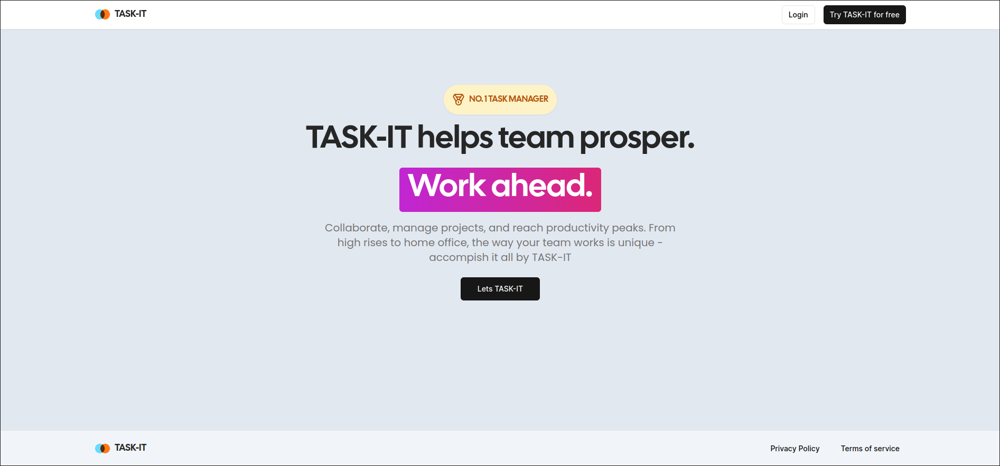
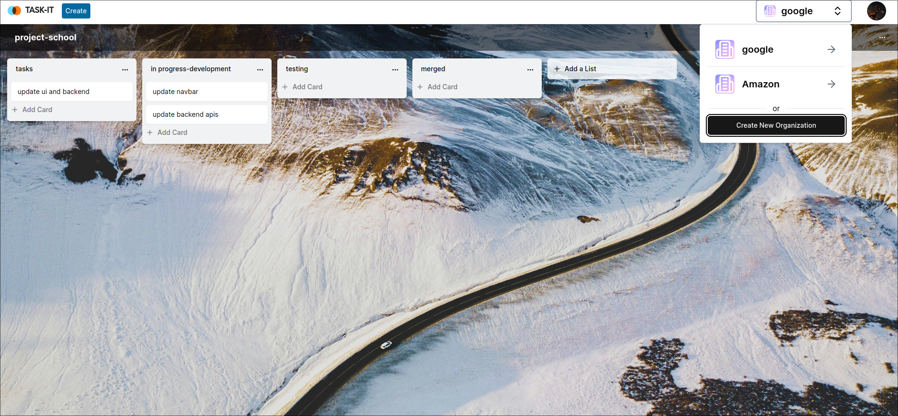

# Kanban Board Application





## Description

This is a Kanban board application built with Next.js, React, TypeScript, PostgreSQL, Redis, and implements drag and drop functionality. It allows users to create and manage their own Kanban boards for organizing tasks efficiently.

## Technologies Used

### Next.js

Next.js is a React framework that enables server-side rendering, providing better performance and SEO benefits. It simplifies the setup of React applications by providing built-in routing and server-side rendering capabilities.

### React

React is a JavaScript library for building user interfaces. It allows developers to create reusable UI components, making it easier to manage complex UIs. In this application, React is used for building the frontend components and managing the application state.

### TypeScript

TypeScript is a superset of JavaScript that adds static typing to the language. It helps catch errors early in the development process and improves code maintainability by providing better code documentation and IDE support.

### PostgreSQL

PostgreSQL is a powerful, open-source relational database management system. It is used to store and manage the application's data, including user accounts, Kanban boards, and tasks.

### Redis

Redis is an in-memory data structure store that is used as a caching layer in this application. It helps improve the performance of the application by caching frequently accessed data, reducing the load on the database.

## Features

- **Drag and Drop**: Users can easily move tasks between different columns of the Kanban board using drag and drop functionality.
- **Create and Manage Boards**: Users can create new Kanban boards, add columns, and customize the board layout according to their workflow.
- **User Authentication**: Secure user authentication system allows users to sign up, log in, and manage their accounts.
- **Data Persistence**: Application data is persisted in the PostgreSQL database, ensuring data integrity and reliability.
- **Caching**: Redis caching improves the performance of the application by reducing database load and speeding up response times.

This is a [Next.js](https://nextjs.org/) project bootstrapped with [`create-next-app`](https://github.com/vercel/next.js/tree/canary/packages/create-next-app).

## Getting Started

First, run the development server:

```bash
npm run dev
# or
yarn dev
# or
pnpm dev
# or
bun dev
```

Open [http://localhost:3000](http://localhost:3000) with your browser to see the result.

You can start editing the page by modifying `app/page.tsx`. The page auto-updates as you edit the file.

This project uses [`next/font`](https://nextjs.org/docs/basic-features/font-optimization) to automatically optimize and load Inter, a custom Google Font.

## Learn More

To learn more about Next.js, take a look at the following resources:

- [Next.js Documentation](https://nextjs.org/docs) - learn about Next.js features and API.
- [Learn Next.js](https://nextjs.org/learn) - an interactive Next.js tutorial.

You can check out [the Next.js GitHub repository](https://github.com/vercel/next.js/) - your feedback and contributions are welcome!

## Deploy on Vercel

The easiest way to deploy your Next.js app is to use the [Vercel Platform](https://vercel.com/new?utm_medium=default-template&filter=next.js&utm_source=create-next-app&utm_campaign=create-next-app-readme) from the creators of Next.js.

Check out our [Next.js deployment documentation](https://nextjs.org/docs/deployment) for more details.
